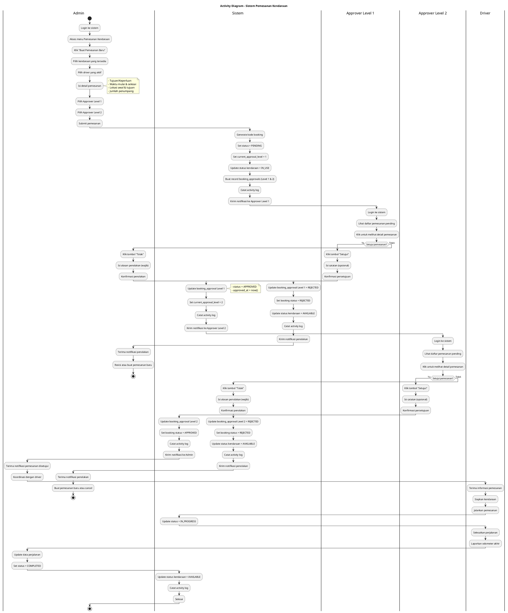

# Activity Diagram - Pemesanan Kendaraan

## Diagram dalam Format Text (PlantUML Compatible)



## Visual Representation (ASCII)

```
┌────────────────────────────────────────────────────────────────────┐
│                    ACTIVITY DIAGRAM                                 │
│              Pemesanan Kendaraan dengan Approval Berjenjang        │
└────────────────────────────────────────────────────────────────────┘

    ┌───────┐
    │ START │
    └───┬───┘
        │
        ▼
┌───────────────────┐
│ Admin login &     │
│ buat pemesanan    │
└─────────┬─────────┘
          │
          ▼
┌───────────────────┐
│ Sistem:           │
│ - Generate code   │
│ - Status=PENDING  │
│ - Level=1         │
│ - Log activity    │
└─────────┬─────────┘
          │
          ▼
┌───────────────────┐
│ Approver Level 1  │
│ review pemesanan  │
└─────────┬─────────┘
          │
    ┌─────┴─────┐
    │           │
    ▼           ▼
┌───────┐   ┌───────┐
│APPROVE│   │REJECT │
└───┬───┘   └───┬───┘
    │           │
    ▼           ▼
┌─────────┐ ┌─────────────────┐
│ Level=2 │ │ Status=REJECTED │
│ Notify  │ │ Vehicle=AVAIL   │
│ Lv.2    │ │ Notify Admin    │
└────┬────┘ └────────┬────────┘
     │               │
     ▼               ▼
┌───────────────────┐   ┌───────┐
│ Approver Level 2  │   │  END  │
│ review pemesanan  │   └───────┘
└─────────┬─────────┘
          │
    ┌─────┴─────┐
    │           │
    ▼           ▼
┌───────┐   ┌───────┐
│APPROVE│   │REJECT │
└───┬───┘   └───┬───┘
    │           │
    ▼           ▼
┌─────────────────┐  ┌─────────────────┐
│ Status=APPROVED │  │ Status=REJECTED │
│ Notify Admin    │  │ Vehicle=AVAIL   │
└────────┬────────┘  └────────┬────────┘
         │                    │
         ▼                    ▼
┌─────────────────┐       ┌───────┐
│ Driver jalankan │       │  END  │
│ pemesanan       │       └───────┘
└────────┬────────┘
         │
         ▼
┌─────────────────┐
│ Status=         │
│ IN_PROGRESS     │
└────────┬────────┘
         │
         ▼
┌─────────────────┐
│ Perjalanan      │
│ selesai         │
└────────┬────────┘
         │
         ▼
┌─────────────────┐
│ Status=         │
│ COMPLETED       │
│ Vehicle=AVAIL   │
└────────┬────────┘
         │
         ▼
    ┌────────┐
    │  END   │
    └────────┘
```

## Keterangan Status

| Status      | Deskripsi                        |
| ----------- | -------------------------------- |
| PENDING     | Menunggu persetujuan             |
| APPROVED    | Disetujui semua level            |
| REJECTED    | Ditolak oleh salah satu approver |
| IN_PROGRESS | Sedang berjalan                  |
| COMPLETED   | Selesai                          |
| CANCELLED   | Dibatalkan oleh admin            |

## Aktor dalam Sistem

| Aktor            | Deskripsi                                                 |
| ---------------- | --------------------------------------------------------- |
| Admin            | Membuat pemesanan, mengelola master data, melihat laporan |
| Approver Level 1 | Atasan langsung, menyetujui/menolak tahap pertama         |
| Approver Level 2 | Manager/Pimpinan, menyetujui/menolak tahap akhir          |
| Driver           | Menjalankan pemesanan yang sudah disetujui                |
| Sistem           | Otomatis mencatat log, update status, kirim notifikasi    |
